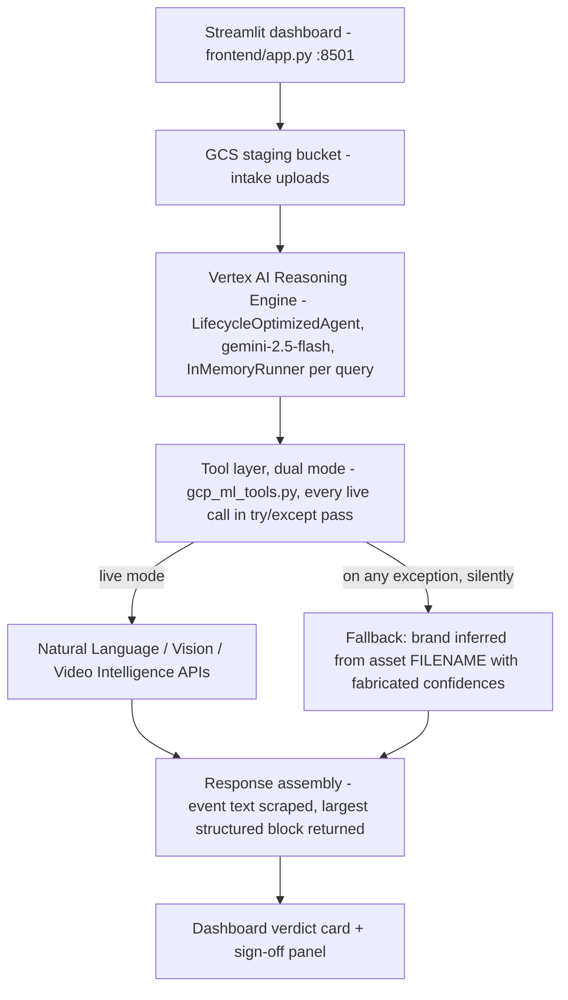
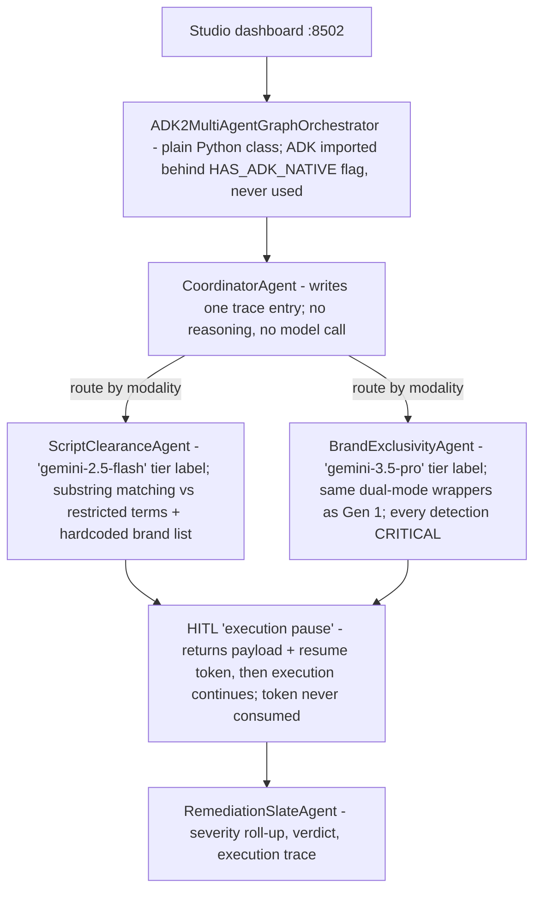
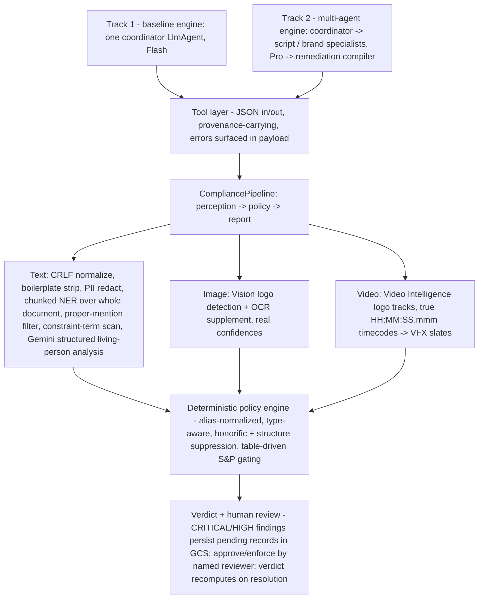
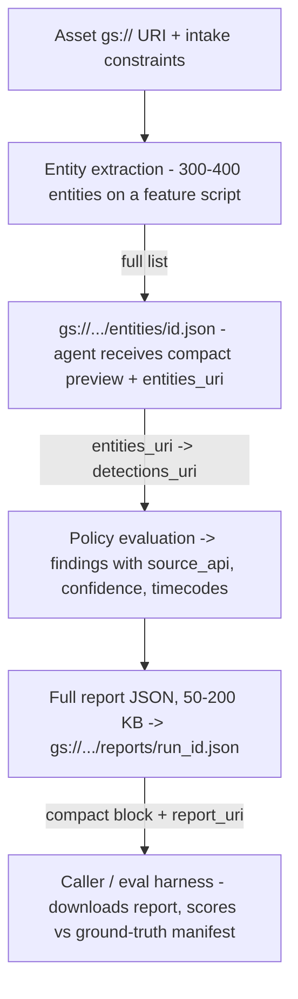

# Three Implementations, One Platform

A code-level review of the Studio Compliance platform across its three
generations: the original single-agent baseline, the ADK 2.0 multi-agent
studio (both preserved under [`legacy/`](../legacy/)), and the production
MVP 1.0 (repository root). A rendered version of this review, with styled
diagrams, is at [`architecture-review.html`](architecture-review.html).

| | Generation 1 | Generation 2 | Generation 3 (current) |
| --- | --- | --- | --- |
| Name | Original Baseline | ADK 2.0 Multi-Agent Studio | MVP 1.0 |
| Location | `legacy/gen1-baseline/` | `legacy/gen2-adk2-studio/` | repository root |
| Character | Working prototype with silent fallbacks | Architectural sketch without an LLM in the loop | Verified production rewrite |

---

## Generation 1 — Original Baseline (single-agent coordinator)

**Key files:** `src/agent.py`, `src/tools/gcp_ml_tools.py`, `deploy/agent.py`,
`frontend/app.py` · deployed to Vertex AI Reasoning Engine · ~35 s per audit.

The baseline established the domain decomposition that survived all three
generations: screenplays (`TEXT_SCREENPLAY`), set/wardrobe images
(`VISUAL_IMAGE`), and rough-cut video (`TEMPORAL_VIDEO`) vetted against
sponsor-exclusivity deals, Standards & Practices rules, and right-of-publicity
exposure.

### Architecture — cloud request path

### Process flow — rule pipeline (`src/agent.py`)

Intake constraints → policy text compiled (then discarded — the return value
was never used) → modality branch:

- **Text**: NER names → **every detected person flagged as a violation**; organizations checked against the restricted list plus a hardcoded brand list.
- **Image**: logo scan → substance category or exclusivity check.
- **Video**: brand timestamps → VFX slate, with timecodes rendered as `00:00:SS` (148 seconds became `00:00:148`).

→ severity roll-up → Pydantic `ComplianceReport` → SQLite session store + structured JSON logs.

### Accomplished
- The right problem, decomposed correctly — the modality split and rule taxonomy carried through every later generation.
- A genuine ADK agent with tool bindings and an instruction prompt, **deployed live** and returning verdicts.
- Real GCP API wrappers with native `gs://` support in live mode.
- Typed Pydantic report schemas; a Streamlit operator dashboard; structured logging and PII-redaction utilities.

### Limitations (fallbacks and simulated parts)
- **The filename fallback was reachable in production.** Any auth or quota failure silently downgraded detection to filename keywords with invented confidence scores.
- The NER fallback was a hardcoded list of the exact names appearing in the sample scripts — high recall on the demo assets, none beyond them.
- The "0/3-Plus Census rule" existed as a label on findings, not as an executed check; every detected person became a violation.
- Script compaction kept only the head and tail of a capped window — the middle of a feature screenplay was never analyzed.
- Report metadata cited `gemini-3.5-pro`, a model that does not exist.

### Drawbacks
- **Silent degradation is the worst possible failure mode for a legal tool**: an asset that was never analyzed could return `CLEARED`.
- Verdicts were extracted from chat text by substring search.
- Broken video timecodes made the VFX slates unusable in editorial.
- Hardcoded project identifiers; committed bytecode and ~100 MB of media; no unit tests of the policy logic.

---

## Generation 2 — ADK 2.0 Multi-Agent Studio

**Key files:** `legacy/gen2-adk2-studio/src/orchestration.py`,
`hitl_controller.py` · second Reasoning Engine deployment · ~0.8 s per audit.

The second generation introduced the coordinator–specialist decomposition and
the human-in-the-loop concept — both of which became real in MVP 1.0. In this
generation they were structural sketches: the "agents" were plain Python
classes carrying model-name strings, and no LLM was invoked anywhere in the
graph. Its headline speed advantage over Generation 1 (~42×) was the speed of
regex against an LLM round-trip.

### Architecture and process flow

### Accomplished
- **The multi-agent decomposition** — coordinator, script specialist, brand specialist, remediation compiler — that MVP 1.0 later implemented with real LLM agents.
- **The HITL contract design**: pause payloads, reviewer roles, resume tokens — a good schema awaiting an implementation.
- Modality routing and per-node execution traces.
- A second live Reasoning Engine deployment alongside the baseline.

### Limitations (fallbacks and simulated parts)
- **No LLM in the loop.** `model_tier` strings were decorative; specialists executed keyword matching over the same dual-mode tool outputs as Generation 1.
- HITL never paused anything — findings were annotated and the workflow ran to completion.
- The flagship module imported `src.models.schemas`, a path that did not exist; as committed, it could never have been imported successfully.
- Perception inherited the filename-fallback layer wholesale.

### Drawbacks
- **Architecture as nomenclature** — class names promised behavior the code did not perform, which made the system harder to evaluate honestly than a plain pipeline.
- Benchmark claims were circular: the "40-cell matrix" scored a system recognizing its own test filenames, and the report's "100% consistency" summary was written unconditionally, even for errored runs.
- The headline latency/accuracy comparison against Generation 1 measured different mechanisms, not better ones.
- Near-duplicate source trees drifting independently.

---

## Generation 3 — MVP 1.0 (production rewrite, repository root)

**Verified live** across five QA rounds and a final acceptance run in an
enterprise GCP environment: two Agent Engine deployments (baseline and
multi-agent), 6/6 smoke gates each, and scored evaluations against a labeled
ground-truth manifest. Details in [`VERIFICATION.md`](VERIFICATION.md).

A ground-up rewrite around one principle: **evidence over vibes**. Both
deployable tracks are real ADK `LlmAgent`s, but they share a single audited
pipeline — agents route, reason, and explain; they cannot invent facts. There
is no fallback path anywhere in production code: a failed perception stage
produces a `FAILED` verdict ("this asset was **not** fully vetted"), never a
fabricated clearance. Mock perception exists only inside the test suite.

### Architecture — two agent tracks over one audited core

Verdict ladder: `FAILED` > `BLOCKED` > `CONDITIONAL_CLEARANCE` > `CLEARED`.
LOW and INFO findings are advisory and never gate the verdict.

### Data flow — state passed by reference, never through the model's context

### Final acceptance metrics

| Metric | Local pipeline | Deployed engine |
| --- | --- | --- |
| Smoke gates | — | 6/6 on both engines |
| Verdict accuracy | 85.7% (12/14) | 84.6% (11/13) |
| Entity recall | 79.2% | 78.3% |
| Forbidden-entity (precision-trap) violations | 0 | 0 |
| Silent failures | 0 | 0 |

Scores are computed by the eval harness against a labeled manifest; infra
failures are bucketed separately from wrong verdicts and never counted as
accuracy.

### Accomplished (verified live)
- **Every README claim is backed by a live run**: deployment (~90 s builds), smoke gates, remote evaluations, specialist routing, constraint gating, and the full HITL lifecycle.
- Fail-loud semantics end to end — zero silent failures across all validation rounds.
- Honest evaluation: labeled manifest, computed scores, unstable assets explicitly unscored.
- Deployable by anyone: environment-driven configuration, Terraform (APIs, bucket TTLs, service-agent IAM), CI, no hardcoded identity.
- Real HITL: persisted pending reviews, named-reviewer approve/enforce, double-resolution rejected, verdict recompute.

### Limitations (known behavior)
- The two remaining verdict deltas are **honest conservatism**: an 1895 play returns `CONDITIONAL_CLEARANCE` because real institutions appear in dialogue with no clearance on file.
- Ten-minute-plus video works locally (~9.4 min analysis) but can hit proxy 503 stream resets when run through the deployed engine behind enterprise certificate proxies — an environment constraint, with one retry built in.
- Video Intelligence emits sub-second flicker detections on CG content — reported truthfully as MEDIUM findings today.
- LLM portrayal-risk grading (HIGH vs. MEDIUM for living public figures) can vary between runs; documented in the manifest rather than masked.
- Logo detection cannot see pattern-similarity infringement — a trade-dress lookalike with no explicit logo legitimately clears under current rules.

### Drawbacks (accepted trade-offs)
- Video Intelligence dominates cost and wall-clock time (per-minute billing).
- Reports and entity payloads live in GCS — callers need bucket access; the conversational reply alone is deliberately not the full record.
- The file-per-record HITL store suits a small reviewer team, not a high-concurrency review desk.
- Deterministic policy tables (aliases, substance brands) require curation as coverage grows.

---

## Side-by-side comparison

| | Gen 1 · Baseline | Gen 2 · ADK 2.0 Studio | Gen 3 · MVP 1.0 |
| --- | --- | --- | --- |
| LLM in the loop | Yes — one deployed agent (chat-scraped output) | No — model names as labels only | Yes — coordinator + specialists, plus structured-output script analysis |
| Perception on failure | Silent filename fallback with invented confidences | Same fallback inherited | Raises; report becomes `FAILED`; no fallback path exists |
| Human in the loop | Status labels on findings | Payload + token designed; never pauses | Persisted queue, named reviewer, approve/enforce, verdict recompute — verified remotely |
| Evaluation integrity | Substring-match verdicts; demo-tuned fallbacks | Hardcoded "100% consistency" written unconditionally | Labeled manifest; computed recall/accuracy; errors bucketed separately |
| Video timecodes | `00:00:148` | inherited | `00:02:28.000` — regression-tested |
| Portability | Hardcoded project + bucket | Hardcoded project + bucket | `STUDIO_*` env config + Terraform; any GCP project |
| Tests | 0 unit tests of logic | script-style checks | 73 (mocks confined to `tests/`) |
| Typical latency | ~35 s | ~0.8 s (no model, no live APIs) | seconds (text/image) · ~10 min (long video, API-bound) |

**The through-line:** Generation 1 proved the domain and the deployment path.
Generation 2 sketched the right architecture without implementing it.
Generation 3 kept both contributions — the domain decomposition and the
coordinator–specialist shape — and rebuilt the execution so that every number
the system reports can be traced to a real API response, a real model call, or
a named human decision.

---

## Future work

Deliberately deferred, in rough priority order. None block production use for
the verified workflows.

1. **Segment-scoped video analysis** — analyze editor-specified ranges (`video_context.segments`) or poll long-running operations asynchronously; removes the long synchronous stream that enterprise proxies reset and cuts Video Intelligence cost 5–10× on feature-length cuts. *(Reliability · Cost)*
2. **Detection quality floor for video** — a track-duration / confidence threshold as an auditable policy rule, converting sub-second flicker false positives into advisory findings. *(Precision)*
3. **Script–video timestamp alignment** — speech-to-text plus forced alignment builds a scene index joining screenplay text to timecodes, enabling contextual checks logo detection cannot see (negative sponsor portrayal, behavioral S&P content, likeness appearances); contextual LLM judgments route to HITL, never auto-block. *(Capability)*
4. **Pattern-similarity infringement pass** — a contextual multimodal review for trade-dress lookalikes where no explicit logo exists. *(Capability)*
5. **Period / historical-context handling** — an era-aware clearance whitelist, or a classification pass separating historical-context references from commercial ones, keeping the conservative default. *(Precision)*
6. **Upload and transcode efficiency** — hash-based upload de-duplication and low-resolution proxy transcodes before Video Intelligence submission. *(Cost)*
7. **HITL on Firestore** — transactional review records for concurrent legal reviewers. *(Scale)*
8. **Hardening the agent contract** — a `response_schema` on the coordinator and client-side 429/backoff retries in the perception layer. *(Robustness)*

**Dataset hygiene, carried forward:** the benchmark suite contains two
byte-identical file pairs (the "Elephants Dream teaser" is device-promo
footage; the "beverage can" duplicates the handbag image). Sourcing true
negative-control media would sharpen the eval; the ground-truth manifest
absorbs new labeled assets as one-line additions.
