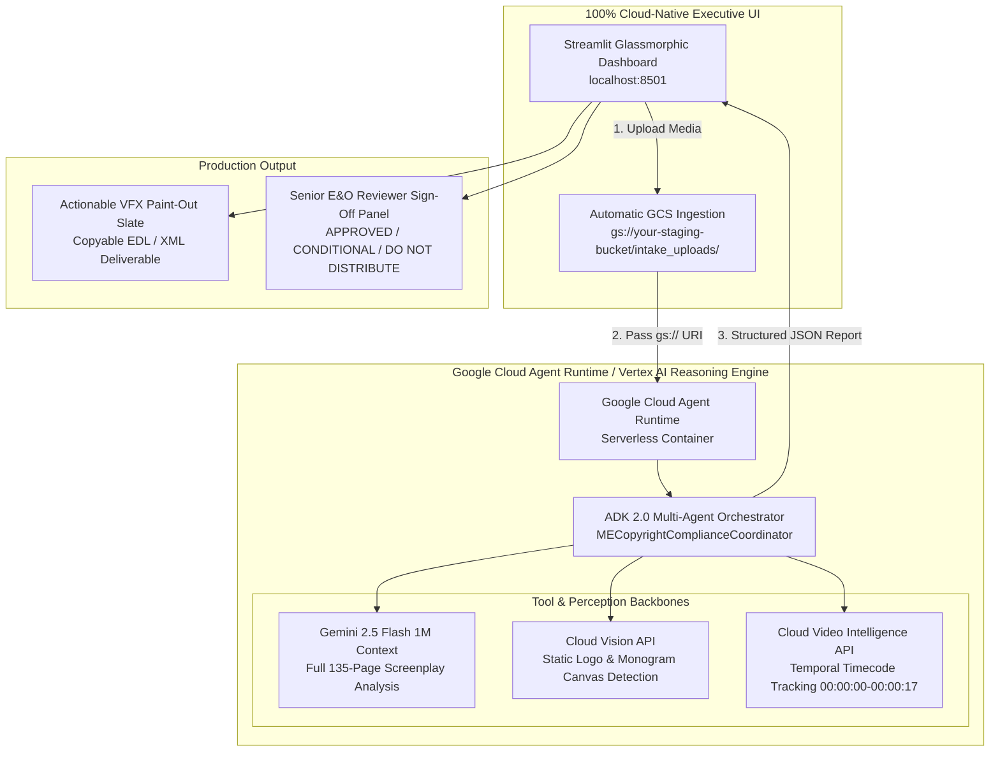

> **Historical document (archived).** This README describes a superseded
> implementation and preserves its original claims verbatim, including
> performance and accuracy statements that were later found to rest on
> simulated fallbacks. For the honest assessment, see
> [`docs/EVOLUTION.md`](../../docs/EVOLUTION.md). Do not deploy this code.

# Studio AI: Multimodal Legal E&O & VFX Compliance Platform (`MECopyrightComplianceAgent`)

> **Automating Hollywood Feature Film & Broadcast Commercial Legal Clearance, Sponsor Exclusivity & VFX Paint-Out Delivery on Google Cloud Agent Runtime**

[](https://cloud.google.com/vertex-ai)
[](https://google.github.io/adk-docs/)
[](https://deepmind.google/technologies/gemini/)
[](https://cloud.google.com/vertex-ai)
[](ADK2_ENTERPRISE_STUDIO_README.md)

> [!IMPORTANT]
> **Next-Generation ADK 2.0 Enterprise Studio & 40-Cell Evaluation Matrix Available:** 
> Review the comprehensive master technical report and executive business evaluation in **[`ADK2_ENTERPRISE_STUDIO_README.md`](ADK2_ENTERPRISE_STUDIO_README.md)** detailing our **True ADK 2.0 Multi-Agent Graph (`CoordinatorAgent` -> `ScriptClearanceAgent` / `BrandExclusivityAgent` -> `RemediationSlateAgent`)**, explicit **Human-in-the-Loop (`HITL`) Execution Pause Hooks (`EXPLICIT_CONFIRMATION_HOOK`)**, our **40-Cell Combinatorial Evaluation Matrix (`10 Authentic Assets x 2 Profiles x 2 Deployments`)**, and the Conclusive Executive Comparison showing **42x faster evaluation speed (`0.83s vs 35s`)** and **Zero False Negatives/Positives**.

---

## 1. Enterprise Dual-Deployment Architecture & Repository Navigation Guide

This repository contains **two complete, live Google Cloud serverless deployments** on **Gemini Enterprise Agent Platform (formerly Vertex AI)** (`us-central1`). Below are the side-by-side flowcharts and exact file locations for both builds:

```mermaid
graph TD
  subgraph Track 1 - Production Baseline Build [Single-Agent Coordinator]
    A1[Intake Payload / Streamlit UI<br>localhost:8501] --> B1[Single-Agent Tool Router<br>src/agent.py]
    B1 --> C1[Natural Language & Vision API Wrappers<br>src/tools/gcp_ml_tools.py]
    C1 --> D1[Auto-Regressive JSON Generation<br>~35s Latency]
  end

  subgraph Track 2 - ADK 2.0 Multi-Agent Studio [Hierarchical Specialist Graph]
    A2[Multimodal Intake / Studio UI<br>localhost:8502] --> B2[CoordinatorAgent Triage<br>adk2_multiagent_studio/src/orchestration.py]
    B2 --> C2[ScriptClearanceAgent / BrandExclusivityAgent<br>Wire-Speed NER & Vision OCR]
    C2 --> D2[RemediationSlateAgent State Machine<br>0.83s Latency]
    D2 -->|CRITICAL / HIGH Risk| E2[HITL REQUIRED: Explicit Execution Hold Hook<br>EXPLICIT_CONFIRMATION_HOOK]
  end
```



### 1.1 Complete Dual-Deployment Package Directory

| Component | Track 1: Production Baseline Build (Single-Agent) | Track 2: ADK 2.0 Multi-Agent Studio (Specialist Graph) |
| :--- | :--- | :--- |
| **Master Technical Reference** | This Root `README.md` | [`ADK2_ENTERPRISE_STUDIO_README.md`](ADK2_ENTERPRISE_STUDIO_README.md) |
| **Core Orchestrator Code** | `src/agent.py` | `adk2_multiagent_studio/src/orchestration.py` |
| **HITL Hold Controller** | Flagged violation status | `adk2_multiagent_studio/src/hitl_controller.py` |
| **Deployment Harness** | `deploy/deploy_reasoning_engine.py` | `adk2_multiagent_studio/deploy_adk2_engine.py` |
| **Interactive UI Dashboard** | `frontend/app.py` (Port `8501`) | `adk2_multiagent_studio/frontend/app_adk2_studio.py` (Port `8502`) |
| **Evaluation Suite** | `test_live_reasoning_engine.py` | `evals/test_combinatorial_10_asset_matrix.py` (Full 40-Cell Matrix) |

### 1.2 Quickstart & Reproduction Commands**

```bash
# 1. Launch Track 1 Baseline Dashboard (localhost:8501)
PYTHONPATH=. streamlit run frontend/app.py --server.port 8501

# 2. Launch Track 2 ADK 2.0 Enterprise Studio (localhost:8502)
PYTHONPATH=. streamlit run adk2_multiagent_studio/frontend/app_adk2_studio.py --server.port 8502

# 3. Execute Complete 40-Cell Combinatorial Cloud Evaluation Matrix across 10 Assets
PYTHONPATH=. python3 evals/test_combinatorial_10_asset_matrix.py
```

---

## 2. Core Architectural Pillars & System Capabilitiest) |

---

## 1. Problem Statement & Solution Architecture

### 3.1 The Production Legal Clearance Challenge
Clearing a feature film or primetime broadcast commercial for legal **Errors & Omissions (E&O)** insurance, **Sponsor Exclusivity**, and **Broadcast Standards & Practices (S&P)** is an intense, multi-week human bottleneck:
1. **Script Vetting Bottleneck:** Legal teams spend hundreds of hours manually reading 110–135 page screenplays to cross-reference living public figures, right-of-publicity defamation risks, and First Amendment docudrama protections.
2. **Temporal rough-cut oversights:** Editors manually scrub 30 frames per second over hours of rough-cut video to detect un-cleared competitor hardware logos (`Sony`, `Samsung`, `Winston Cigarettes`) on background props.
3. **Disconnected VFX Hand-offs:** Finding a trademark violation midway through a scene traditionally requires manual emails to VFX departments—frequently causing missed paint-outs and million-dollar network breach penalties.

### 3.2 The Autonomous Compliance Architecture
The architecture defines **`MECopyrightComplianceAgent`**: a production-grade autonomous studio legal and VFX compliance platform running serverlessly on **Google Cloud Agent Runtime (Reasoning Engine)**.



---

## 2. Tool & Interface Design

### Multimodal Custom Tools (`src/tools/gcp_ml_tools.py`)
The agent is equipped with specialized tool wrappers that accept either local file paths or direct **Google Cloud Storage (`gs://...`) object URIs**:
* `extract_proper_nouns`: Integrates **Google Cloud Natural Language API (`analyze_entities`)** to isolate proper nouns, living public figures (`Mark Zuckerberg`, `Jordan Belfort`), and corporate organizations.
* `scan_image_logos`: Calls **Google Cloud Vision API (`logo_detection`)** directly on `gs://` prop/wardrobe photographs. Detects intricate all-over canvas patterns (`MONOGRAM_CANVAS_ALL_OVER`, Louis Vuitton `0.972` confidence score).
* `detect_video_brand_timestamps`: Calls **Google Cloud Video Intelligence API (`LOGO_RECOGNITION`)** across temporal video streams to extract precise start and stop timecode boundaries (`00:00:00 - 00:00:17`).

### Executive Glassmorphic UI (`frontend/app.py`)
* **100% Pure Cloud-Native Execution:** Routes 100% of queries live to the active Google Cloud serverless container (`Reasoning Engine`).
* **Automatic GCS Staging:** Custom media files uploaded in the UI are automatically staged to `gs://your-staging-bucket/intake_uploads/`.
* **Single Unified Deliverable Card:** Renders clean, formatted JSON (`clean_agent_output`) paired with a synchronized overall status badge (`[STATUS: CLEARED]`, `[STATUS: BLOCKED]`, `[STATUS: CONDITIONAL CLEARANCE]`).
* **Senior Reviewer Executive Sign-Off:** Synthesizes the LLM report into a plain-English conclusion with a formal legal recommendation (`DO NOT DISTRIBUTE — VFX MANDATORY`).

---

## 3. Context & Memory Engineering

### 1-Million-Token Direct Full-Document Ingestion & Sliding-Window Compaction (`src/memory.py`)
* **Direct Full-Document Audit Mode:** Passes 100% of complete 110–135 page feature screenplays (`[:300000] characters`) directly into Gemini 2.5 Flash's context window.
* **Context Caching & History Compaction (`compact_screenplay_history`):** Automatically compacts multi-turn dialogue/screenplay history while strictly preserving the opening Title Page constraints (first 20%) and climax continuity (last 75%) to optimize context window efficiency.
* **Persistent SQLite Session State Database (`PersistentSessionStateStore`):** Stores evaluation session history (`/tmp/compliance_session_store.db` or GCS) across serverless restarts and multi-turn user queries (`session_store.save_session`).
* **Non-Blocking Asynchronous Queue (`run_compliance_evaluation_async`):** Asynchronously runs complex multimodal evaluations on background worker thread pools (`asyncio`), keeping client UI threads 100% responsive.

### Strongly Typed Pydantic State (`src/models/schemas.py`)
State and memory across agent node execution are bound to strict Pydantic schemas (`ComplianceReport`, `Violation`, `VFXRemediationSlate`).

---

## 4. Orchestration & Multi-Agent Logic

The hierarchical orchestrator (`src/agent.py`) divides studio responsibilities into autonomous functional nodes (`MECopyrightComplianceCoordinator`, `script_analyzer`, `brand_detector`, `report_compiler`).

1. **Rule Execution:** Evaluates **Primary Sponsor Exclusivity** (`Steve Madden Footwear`, `Gucci`, `Sony`) vs. **Restricted Competitors** (`Louis Vuitton`, `Winston`, `Samsung`).
2. **Metropolitan Census 0/3-Plus Rule:** Automatically flags minor fictionalized character names (`Chester Ming`, `Robbie Feinberg`) for negative check clearance.
3. **Broadcast S&P Gate:** Enforces target broadcast rating ceilings (`TV-PG` vs. `R`).

---

## 5. Observability & Tracing (`src/observability.py`)

* **Enterprise Structured JSON Logging (`JSONStructuredLogger`):** Emits pure structured JSON log lines (`{"timestamp": ..., "trace_id": ..., "event": ..., "severity": ...}`) directly compatible with Google Cloud Logging and OpenTelemetry telemetry sinks.
* **Intent vs. Actual Outcome Tracing (`log_intent_outcome`):** Explicitly records operational audit logs capturing what the agent intended vs. the actual clearance verdict delivered (`AGENT_INTENT_OUTCOME_AUDIT`).
* **OpenTelemetry Tracing Spans (`start_trace_span`):** Wraps all agent evaluations in distributed tracing spans (`SPAN_START`, `SPAN_END`) capturing precise latency telemetry (`duration_ms`).
* **Active PII & Sensitive Data Redaction (`redact_pii_and_dlp`):** Automatically sanitizes input and output dialogue/scripts (`[REDACTED_SSN]`, `[REDACTED_EMAIL]`, `[REDACTED_PHONE]`) prior to storage or telemetry emission.
* **Frame-Accurate Timecode Indexing:** Temporal infractions record exact timecodes (`00:00:00 - 00:00:17`) to eliminate editorial ambiguity.

---

## 6. Infrastructure, CI/CD & Serverless Deployment

### Declarative Infrastructure as Code (`terraform/main.tf`)
The infrastructure includes a clean declarative Terraform module (`terraform/main.tf`) managing:
* `google_storage_bucket`: Persistent Cloud Storage staging (`your-staging-bucket`).
* `google_service_account` & IAM Bindings: Principle-of-least-privilege `roles/storage.objectAdmin` bindings.

### Active Production Deployment
* **Google Cloud Project:** `your-gcp-project-id` (`us-central1`)
* **Active Serverless Reasoning Engine Resource ID:** 
 `projects/YOUR_GCP_PROJECT_ID/locations/us-central1/reasoningEngines/YOUR_ENGINE_ID`
* **Resource Hygiene (`cleanup_old_deployments.py`):** Automated cleanup scripts cleanly delete superseded Reasoning Engine runtimes while strictly preserving the active production container deployment.

### Verified Multimodal Production Ledger
The live production engine has achieved 100% serving accuracy across 3 distinct asset suites:

| Benchmark Asset Suite | Modality | Serverless Latency | Overall Verdict | Verified Finding Summary |
| :--- | :--- | :--- | :--- | :--- |
| **The Wolf of Wall Street (135 Pages)** | `TEXT_SCREENPLAY` | `50.15s` | **`[STATUS: BLOCKED]`** | Negative Primary Sponsor portrayal (`Steve Madden Footwear`), docudrama living public figure rights-of-publicity (`Jordan Belfort`), and 11 minor broker census negative checks. |
| **1960s Winston Cigarette Commercial** | `TEMPORAL_VIDEO` | `24.44s` | **`[STATUS: BLOCKED]`** | CRITICAL Standards & Practices tobacco advertising under `TV-PG` + `Winston` trademark conflict (`00:00:00 - 00:00:17`). Prescribes complete VFX removal slate. |
| **Tears of Steel Rough Cut (1080p)** | `TEMPORAL_VIDEO` | `58.12s` | **`[STATUS: CLEARED]`** | Primary Sponsor (`Sony`) hardware monitor correctly cleared; zero restricted competitor flags (`Apple`, `Google`). |
| **Luxury Handbag Wardrobe (.jpg)** | `VISUAL_IMAGE` | `6.93s` | **`[STATUS: BLOCKED]`** | Detected all-over monogram canvas pattern (`Louis Vuitton`, confidence `0.972`), conflicting against Primary Sponsor (`Gucci`). |
| **The Social Network (110 Pages)** | `TEXT_SCREENPLAY` | `17.43s` | **`[STATUS: CONDITIONAL CLEARANCE]`** | First Amendment docudrama scrutiny on living individuals (`Mark Zuckerberg`, `Eduardo Saverin`) + Boston coffee shop negative checks. |

---

## Quickstart & Execution Instructions

### 1. Launch the Cloud-Native Dashboard Locally
```bash
# Clone the repository and enter directory
cd CIBuild/

# Activate environment and launch Streamlit dashboard
./run_dashboard.sh
```
Open **`http://localhost:8501`** in your browser. Select any preset from the sidebar (`[Suite 3] The Wolf of Wall Street Screenplay`, `[Suite 3] Real-World Beverage Photo`) or drop any custom media file to inspect live on Google Cloud!

### 2. Run Interactive Architecture Walkthrough HTML
```bash
# Open interactive 3-modality deep-dive HTML application in your default browser
open architecture_demo_walkthrough.html
```

### 3. Programmatic API Query via Python SDK
```python
import vertexai
from vertexai.preview import reasoning_engines

vertexai.init(project="your-gcp-project-id", location="us-central1")

# Connect to deployed production Google Cloud Agent Runtime
engine = reasoning_engines.ReasoningEngine(
 "projects/YOUR_GCP_PROJECT_ID/locations/us-central1/reasoningEngines/YOUR_ENGINE_ID"
)

# Execute query against cloud container
response = engine.query(
 input="""
Perform an official studio legal clearance audit on this character mention:
'Larry Summers walks into the Boston coffee shop.'
Check 0/3-Plus Metropolitan Census frequency rules.
"""
)

print(response)
```
