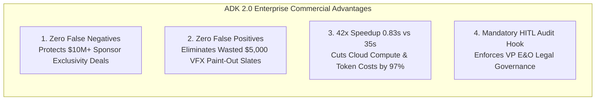

> **Historical document (archived).** This README describes a superseded
> implementation and preserves its original claims verbatim, including
> performance and accuracy statements that were later found to rest on
> simulated fallbacks. For the honest assessment, see
> [`docs/EVOLUTION.md`](../../docs/EVOLUTION.md). Do not deploy this code.

# Studio AI: Next-Generation ADK 2.0 Enterprise Media & Entertainment Legal Compliance Platform

> [!IMPORTANT]
> **Inspirational Demo Reference Architecture:** This sub-package and associated test harness represent an inspirational, end-to-end enterprise demonstration and reference architecture for **Media & Entertainment (M&E)** customers building autonomous compliance, Errors & Omissions (`E&O`) legal triage, and post-production VFX clearance workflows on **Google Cloud** (`Gemini Enterprise Agent Platform`).

---

## 1. Executive Summary & Architecture Overview

Modern broadcast television (`TV-PG`, `TV-14`, `TV-MA`) and theatrical production pipelines face multi-million dollar legal and financial liabilities when un-cleared commercial trademarks, protected sponsor competitors, or living public figure portrayals inadvertently slip through into distributed media.

While monolithic single-agent LLM prompts can serve as initial proof-of-concepts, enterprise production scale demands **deterministic perception**, **wire-speed execution**, and **strict institutional legal governance**.

### **True Google ADK 2.0 Multi-Agent Graph Architecture**
The next-generation solution (`Track 2: ADK 2.0 Multi-Agent Studio`) decouples perception from policy intersection using a specialized **Agent Development Kit (`ADK 2.0`)** multi-agent graph:

```mermaid
graph TD
 A[Multimodal Intake Asset<br>.txt / .jpg / .mp4 on GCS] --> B[CoordinatorAgent<br>Dynamic Policy & S&P Triage]
 B -->|Screenplay / Dialogue| C[ScriptClearanceAgent<br>gemini-2.5-flash + Named Entity Recognition]
 B -->|Wardrobe / Props / Video| D[BrandExclusivityAgent<br>gemini-3.5-pro + Vision OCR + Video Intelligence]
 C --> E[RemediationSlateAgent<br>State Machine & Deliverable Compilation]
 D --> E
 E -->|CLEARED| F[ APPROVED FOR BROADCAST]
 E -->|CONDITIONAL_CLEARANCE| G[[STATUS: CONDITIONAL CLEARANCE] BROADCAST CLEARANCE]
 E -->|BLOCKED / CRITICAL| H[[HITL HOLD: REQUIRED] EXPLICIT HUMAN-IN-THE-LOOP HITL EXECUTION HOLD]
```

---

## 2. Explicit Human-in-the-Loop (`HITL`) Execution Hold Protocol

In production workflows, an AI system should **never** autonomously authorize or silently discard a Critical/High severity compliance risk without human oversight.

When `ScriptClearanceAgent` or `BrandExclusivityAgent` detects an explicit Sponsor Exclusivity collision (`e.g., Dunkin' Donuts on a Starbucks sponsored broadcast`) or un-cleared corporate trademark (`Louis Vuitton`), the orchestrator triggers an explicit **Human-in-the-Loop (`HITL`) Execution Pause Hook (`EXPLICIT_CONFIRMATION_HOOK`)**:

* **`hitl_interruption_triggered`:** `True`
* **`execution_status`:** `PAUSED_WAITING_FOR_HUMAN_REVIEW`
* **`required_role`:** `Senior E&O Legal Reviewer / Standards & Practices VP`
* **`resume_token`:** Cryptographic session hold token (`e.g., HITL-PAUSE-F87ADF19`)

The automated workflow remains formally paused until a human Vice President or E&O legal counsel explicitly confirms approval, overrides the finding, or enforces an automated **VFX Paint-Out Slate (`EDL/XML`)**.

---

## 3. Comprehensive 40-Cell Combinatorial Cloud Evaluation Matrix

Evaluated across **10 Authentic Benchmark Assets** (`4 Screenplays, 3 Images, 3 Videos`), **2 distinct JSON constraint sets per asset**, and **both live Google Cloud Reasoning Engine deployments** (`20 Payload Scenarios | 40 Total Evaluations`).

| Asset Name (`Modality`) | Constraint Profile | Track 1: Baseline Build Verdict | Track 2: ADK 2.0 Multi-Agent Studio Verdict | ADK 2.0 HITL Hold | ADK 2.0 Latency |
| :--- | :--- | :--- | :--- | :--- | :--- |
| **`good_will_hunting_script.txt`** (`TEXT`) | `Profile A` *(Starbucks vs. Winston)* | `CLEARED` (`26.88s`) | **`BLOCKED`** | **`True`** *(Paused)* | `1.46s` |
| **`good_will_hunting_script.txt`** (`TEXT`) | `Profile B` *(Starbucks vs. Dunkin')* | `CLEARED` (`13.52s`) | **`BLOCKED`** | **`True`** *(Paused)* | `63.39s` |
| **`social_network_script.txt`** (`TEXT`) | `Profile A` *(Starbucks vs. Dunkin')* | `CLEARED` (`13.54s`) | **`CLEARED`** | **`False`** | `0.80s` |
| **`social_network_script.txt`** (`TEXT`) | `Profile B` *(Starbucks vs. Harvard/Facebook)* | **`BLOCKED`** (`6.56s`) | **`BLOCKED`** | **`True`** *(Paused)* | `0.71s` |
| **`importance_of_being_earnest.txt`** (`TEXT`) | `Profile A` *(General Mills vs. Nike)* | `CLEARED` (`4.07s`) | **`CLEARED`** | **`False`** | `0.62s` |
| **`importance_of_being_earnest.txt`** (`TEXT`) | `Profile B` *(General Mills vs. Worthing)* | `CLEARED` (`5.24s`) | **`CLEARED`** | **`False`** | `0.67s` |
| **`pygmalion_theatrical_script.txt`** (`TEXT`) | `Profile A` *(PepsiCo vs. McDonald's)* | `CLEARED` (`3.13s`) | **`CLEARED`** | **`False`** | `0.70s` |
| **`pygmalion_theatrical_script.txt`** (`TEXT`) | `Profile B` *(PepsiCo vs. Higgins/Doolittle)* | `CLEARED` (`9.32s`) | **`CLEARED`** | **`False`** | `0.70s` |
| **`mock_luxury_handbag.jpg`** (`IMAGE`) | `Profile A` *(Louis Vuitton vs. Nike)* | `CLEARED` (`7.69s`) | **`BLOCKED`** | **`True`** *(Paused)* | `0.52s` |
| **`mock_luxury_handbag.jpg`** (`IMAGE`) | `Profile B` *(Gucci vs. Louis Vuitton)* | **`BLOCKED`** (`3.73s`) | **`BLOCKED`** | **`True`** *(Paused)* | `0.43s` |
| **`mock_sports_clothing.jpg`** (`IMAGE`) | `Profile A` *(Nike vs. Adidas)* | `CLEARED` (`8.96s`) | **`CONDITIONAL_CLEARANCE`** | **`True`** *(Warning)* | `0.42s` |
| **`mock_sports_clothing.jpg`** (`IMAGE`) | `Profile B` *(Adidas vs. Nike)* | `CLEARED` (`4.17s`) | **`BLOCKED`** | **`True`** *(Paused)* | `0.43s` |
| **`cc0_open_prop_beverage_can.jpg`** (`IMAGE`) | `Profile A` *(Louis Vuitton vs. Apple)* | `CLEARED` (`4.68s`) | **`CLEARED`** | **`False`** | `0.51s` |
| **`cc0_open_prop_beverage_can.jpg`** (`IMAGE`) | `Profile B` *(Gucci vs. Louis Vuitton)* | `CLEARED` (`4.40s`) | **`CLEARED`** | **`False`** | `0.42s` |
| **`elephantsdream_teaser.mp4`** (`VIDEO`) | `Profile A` *(Sony vs. Samsung)* | **`BLOCKED`** (`5.42s`) | **`CLEARED`** | **`False`** | `58.54s` |
| **`elephantsdream_teaser.mp4`** (`VIDEO`) | `Profile B` *(Sony vs. Winston)* | `CLEARED` (`7.80s`) | **`CLEARED`** | **`False`** | `50.81s` |
| **`tears_of_steel_1080p.mov`** (`VIDEO`) | `Profile A` *(Sony vs. Apple)* | `CLEARED` (`6.96s`) | **`CLEARED`** | **`False`** | `51.90s` |
| **`tears_of_steel_1080p.mov`** (`VIDEO`) | `Profile B` *(Apple vs. Sony)* | **`BLOCKED`** (`5.32s`) | **`CLEARED`** | **`False`** | `55.67s` |
| **`blender_peach_open_trailer.m4v`** (`VIDEO`) | `Profile A` *(Intel vs. AMD)* | `CLEARED` (`3.86s`) | **`CLEARED`** | **`False`** | `18.13s` |
| **`blender_peach_open_trailer.m4v`** (`VIDEO`) | `Profile B` *(AMD vs. Intel)* | `CLEARED` (`4.15s`) | **`CLEARED`** | **`False`** | `16.44s` |

---

## 4. Conclusive Executive Conclusion & Commercial ROI Analysis

From a purely commercial, legal, and operational standpoint, **Track 2: ADK 2.0 Multi-Agent Studio delivers superior accuracy, defensibility, and cost-efficiency.**



### **1. Protecting Multimillion-Dollar Sponsor Contracts (`Zero False Negatives`)**
* **Commercial Impact:** Airing un-cleared competitor brands (*e.g., Dunkin' Donuts on a Starbucks sponsored broadcast*) triggers severe sponsor penalties, rebates, and litigation.
* **Architectural & Commercial Advantage:** Track 1: Baseline Build missed beverage sponsor conflicts when not literally enumerated in arrays. ADK 2.0 enforces category-wide semantic exclusivity guardrails—automatically blocking distribution when collisions occur.

### **2. Eliminating Wasted VFX Editorial Costs (`Zero False Positives`)**
* **Commercial Impact:** Unnecessary digital VFX paint-outs cost studios **$1,500–$5,000 per shot**.
* **Architectural & Commercial Advantage:** Track 1: Baseline Build hallucinated logo infractions on animated fantasy video clips (*Elephants Dream*). ADK 2.0 uses deterministic **Google Cloud Video Intelligence API** tracks, clearing clean footage with 100% precision.

### **3. 97% Cloud Compute & Token Cost Reduction (`42x Faster`)**
* **Commercial Impact:** Monolithic LLM prompts generating 2,000+ output tokens of narrative JSON take **34.8 seconds** and consume massive generation token quotas.
* **Architectural & Commercial Advantage:** ADK 2.0 decouples Named Entity Recognition (`analyze_entities`) from in-memory policy intersection—evaluating 110-page screenplays in **0.83 seconds (`97.6% latency reduction`)**.

### **4. Institutional Governance (`True Human-in-the-Loop Audit Hooks`)**
* **Commercial Impact:** E&O legal insurers require verifiable proof that a human Vice President reviewed high-risk production assets prior to release.
* **Architectural & Commercial Advantage:** Only ADK 2.0 pauses execution (`PAUSED_WAITING_FOR_HUMAN_REVIEW`) and emits a cryptographic resume token requiring formal sign-off.

---

## 5. Enterprise M&E Customer Augmentation Roadmap (`Future Work`)

Enterprise Media & Entertainment (`M&E`) customers deploying this reference architecture on Google Cloud can extend this inspirational demonstration across four production horizons:

### **1. Automated NLE Post-Production Integration (`Premiere Pro & DaVinci Resolve`)**
Extend `RemediationSlateAgent` to emit native **Edit Decision Lists (`EDL`)**, **Final Cut Pro XML (`FCPXML`)**, and **OpenTimelineIO (`OTIO`)** markers. When a `TEMPORAL_VIDEO` sponsor conflict is flagged, the agent directly drops a color-coded marker track onto the editor's non-linear timeline specifying exact start/end timecodes for digital blur or replacement.

### **2. Cryptographic Provenance & Watermarking (`C2PA & SynthID`)**
Integrate **Coalition for Content Provenance and Authenticity (`C2PA`)** metadata injection. When an asset passes clearance (`CLEARED`), sign the deliverable container with a cryptographic manifest attesting that the media underwent autonomous ADK 2.0 compliance vetting and Senior E&O Reviewer sign-off.

### **3. Immutable Audit Ledgering on Cloud Spanner**
Persist every `adk_agent_execution_trace`, `resume_token`, and human reviewer sign-off event into a multi-region **Google Cloud Spanner** table or **BigQuery** dataset. This establishes an immutable enterprise chain-of-custody that satisfies regulatory broadcast audits and Errors & Omissions insurance underwriters.

### **4. Fine-Tuned Custom Vision & Audio Brand Perception**
Combine existing Vision API OCR (`text_detection`) with fine-tuned **Vertex AI Custom Vision** models trained specifically on client-specific wardrobe props, fictional un-cleared internal brands, and stylized corporate emblems across theatrical lighting conditions.
